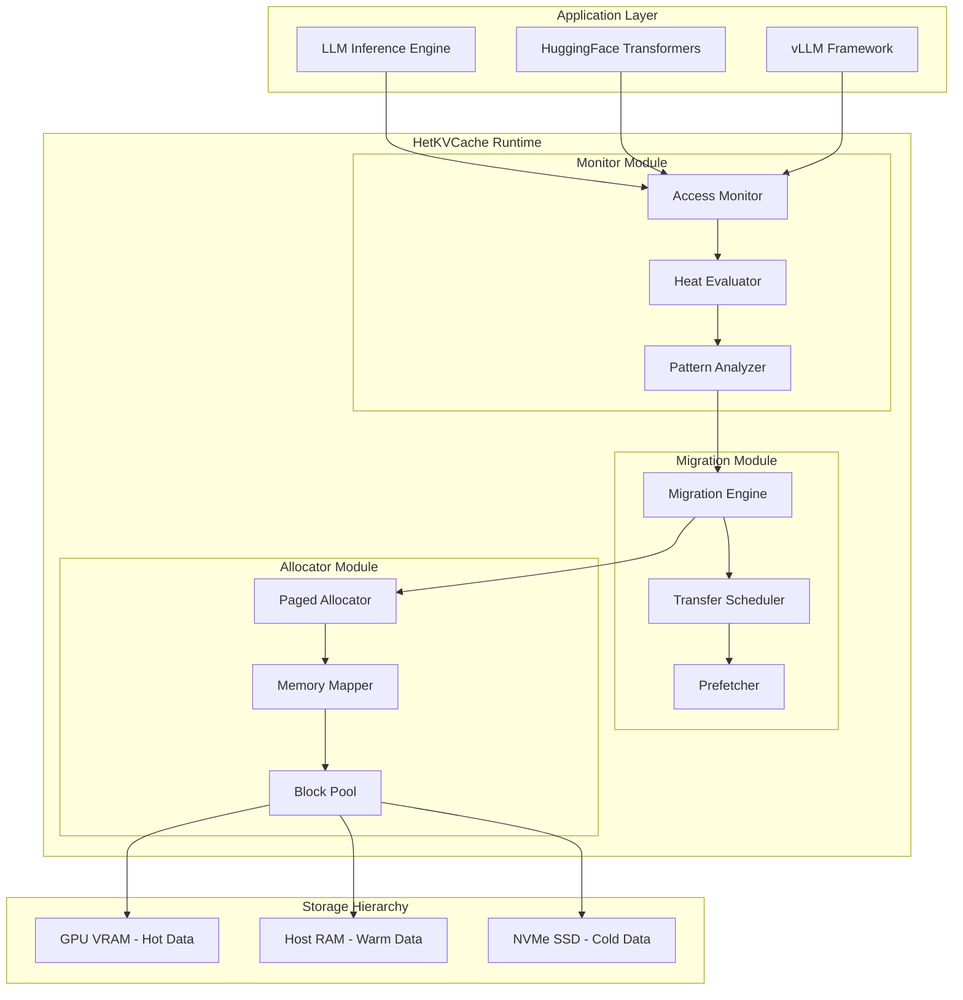
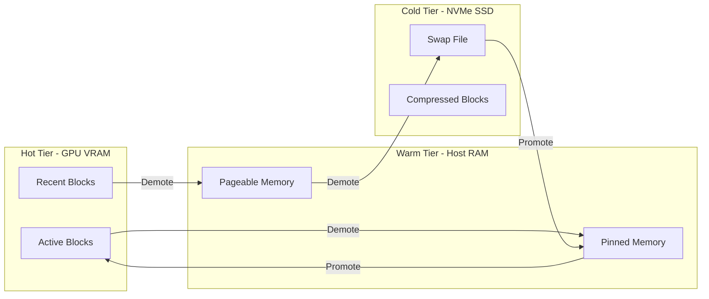

# HetKVCache 系统架构设计文档

## 1. 项目概述

HetKVCache 是一个面向 AI 推理负载的异构存储管理系统，专门优化大语言模型（LLM）推理过程中的 KV Cache 管理。系统通过智能监控、动态迁移和无碎片分配，实现显存、内存和外存之间的高效数据流动。

### 1.1 核心目标

- **吞吐量提升**: 目标提升 30% 以上
- **显存优化**: 支持更长的上下文序列（8K+ tokens）
- **透明集成**: 无需修改主流推理框架源码
- **低延迟迁移**: GPU 等待时间最小化

### 1.2 系统架构图



## 2. 模块详细设计

### 2.1 模块一：监控与热度评估器 (Monitor & Profiler)

#### 2.1.1 功能描述

- **访问监控**: 拦截/Hook LLM 推理进程对 KV Cache 的访问
- **热度评估**: 基于衰减算法计算每个 KV Block 的热度分数
- **模式分析**: 分析不同层、不同注意力头的访问模式差异

#### 2.1.2 核心数据结构

```cpp
// KV Block 访问记录
struct KVBlockAccess {
    uint64_t block_id;        // 块唯一标识
    uint32_t layer_id;        // Transformer 层 ID
    uint32_t head_id;         // 注意力头 ID
    uint64_t timestamp;       // 访问时间戳 (ns)
    uint32_t access_type;     // 读/写类型
    uint64_t sequence_pos;    // 序列位置
};

// 热度分数结构
struct HeatScore {
    uint64_t block_id;
    float score;              // 0.0 - 1.0
    TierType current_tier;    // HOT/WARM/COLD
    uint64_t last_access_ts;
    uint32_t access_count;
    float decayed_score;      // 衰减后的分数
};

// 热度层级
enum class TierType {
    HOT = 0,   // GPU VRAM
    WARM = 1,  // Host RAM
    COLD = 2   // NVMe SSD
};
```

#### 2.1.3 热度评估算法

采用**指数衰减 + 层级加权**的混合策略：

```
heat_score(t) = α * access_frequency + β * recency_score + γ * layer_importance

其中:
- access_frequency = Σ(e^(-λ * (t - t_i)))  // 指数衰减访问频率
- recency_score = e^(-λ * (t - last_access))  // 最近访问时间衰减
- layer_importance = 1.0 / (layer_id + 1)  // 浅层更重要
- α + β + γ = 1.0  // 权重归一化
```

#### 2.1.4 类设计

```cpp
class AccessMonitor {
public:
    void recordAccess(const KVBlockAccess& access);
    void hookKVCacheAccess(void* kvcache_ptr, size_t size);
    void startMonitoring();
    void stopMonitoring();
    
private:
    std::unordered_map<uint64_t, std::deque<KVBlockAccess>> access_history_;
    std::mutex monitor_mutex_;
    std::atomic<bool> monitoring_active_;
};

class HeatEvaluator {
public:
    void updateHeatScores(uint64_t current_time);
    TierType classifyTier(float heat_score);
    std::vector<uint64_t> getBlocksForMigration(TierType from, TierType to);
    
private:
    std::unordered_map<uint64_t, HeatScore> heat_scores_;
    float alpha_ = 0.5f;  // 频率权重
    float beta_ = 0.3f;   // 新近度权重
    float gamma_ = 0.2f;  // 层重要性权重
    float lambda_ = 0.01f; // 衰减系数
};

class AccessPatternAnalyzer {
public:
    void analyzeLayerPattern();
    void analyzeHeadPattern();
    void predictNextAccess();
    PatternReport generateReport();
    
private:
    std::vector<std::vector<float>> layer_access_matrix_;
    std::vector<std::vector<float>> head_access_matrix_;
};
```

### 2.2 模块二：动态多级缓存迁移引擎 (Migration Engine)

#### 2.2.1 功能描述

- **异步传输**: 利用 CUDA Streams 实现异步数据搬运
- **透明迁移**: 对上层推理框架透明，最小化 GPU 等待
- **预取优化**: 基于访问模式预测，提前加载数据

#### 2.2.2 迁移策略



#### 2.2.3 核心数据结构

```cpp
// 迁移任务
struct MigrationTask {
    uint64_t block_id;
    TierType source_tier;
    TierType target_tier;
    void* source_ptr;
    void* target_ptr;
    size_t size;
    int priority;           // 优先级
    cudaStream_t stream;    // CUDA 流
    std::promise<bool> completion;
};

// 迁移统计
struct MigrationStats {
    uint64_t total_migrations;
    uint64_t vram_to_ram;
    uint64_t ram_to_vram;
    uint64_t ram_to_ssd;
    uint64_t ssd_to_ram;
    double avg_migration_time_ms;
    double total_bytes_transferred;
};
```

#### 2.2.4 类设计

```cpp
class MigrationEngine {
public:
    MigrationEngine(size_t vram_budget, size_t ram_budget);
    ~MigrationEngine();
    
    void submitMigration(MigrationTask task);
    void batchMigrate(std::vector<MigrationTask> tasks);
    bool awaitMigration(uint64_t block_id);
    MigrationStats getStats() const;
    
private:
    std::unique_ptr<TransferScheduler> scheduler_;
    std::unique_ptr<Prefetcher> prefetcher_;
    std::unordered_map<uint64_t, MigrationTask> pending_tasks_;
};

class TransferScheduler {
public:
    void scheduleTransfer(MigrationTask& task);
    void optimizeTransferOrder(std::vector<MigrationTask>& tasks);
    void executeAsync(MigrationTask& task, cudaStream_t stream);
    
private:
    std::vector<cudaStream_t> stream_pool_;
    std::priority_queue<MigrationTask> priority_queue_;
    size_t concurrent_transfers_;
};

class Prefetcher {
public:
    void predictAndPrefetch(const std::vector<uint64_t>& candidates);
    void updateModel(const AccessPattern& pattern);
    
private:
    std::unique_ptr<AccessPredictor> predictor_;
    std::deque<uint64_t> prefetch_queue_;
};
```

#### 2.2.5 CUDA 核心函数

```cuda
// 异步内存传输内核
__global__ void asyncTransferKernel(
    const void* src, void* dst, 
    size_t size, cudaStream_t stream
);

// 批量传输优化
__global__ void batchTransferKernel(
    TransferRequest* requests, 
    int num_requests
);

// 压缩/解压缩内核（用于 SSD 存储）
__global__ void compressKernel(
    const float* data, 
    uint8_t* compressed, 
    size_t size
);

__global__ void decompressKernel(
    const uint8_t* compressed, 
    float* data, 
    size_t size
);
```

### 2.3 模块三：无碎片分配器 (Fragmentation-Free Allocator)

#### 2.3.1 功能描述

- **块式分配**: 参考 PagedAttention，使用固定大小块
- **内存池管理**: 预分配内存池，避免动态分配开销
- **碎片整理**: 自动处理碎片，支持动态序列增长

#### 2.3.2 内存布局

```
+------------------+
|   Block Pool     |
+------------------+
| Block 0  | Block 1  | Block 2  | ... | Block N  |
+----------+----------+----------+-----+----------+
| 16KB     | 16KB     | 16KB     | ... | 16KB     |
+----------+----------+----------+-----+----------+

每个 Block 结构:
+------------------+
| Block Header     |  64 bytes
+------------------+
| KV Data          |  ~16KB
+------------------+
  - K cache: 8KB
  - V cache: 8KB
```

#### 2.3.3 核心数据结构

```cpp
// 内存块头
struct BlockHeader {
    uint64_t block_id;
    uint32_t layer_id;
    uint32_t head_id;
    uint64_t sequence_start;
    uint64_t sequence_end;
    TierType tier;
    BlockState state;
    uint64_t ref_count;
    BlockHeader* next;  // 链表指针
    uint8_t padding[32];
};

// 块状态
enum class BlockState {
    FREE = 0,
    ALLOCATED = 1,
    MIGRATING = 2,
    LOCKED = 3
};

// 内存池配置
struct PoolConfig {
    size_t block_size;           // 块大小，默认 16KB
    size_t vram_pool_size;       // VRAM 池大小
    size_t ram_pool_size;        // RAM 池大小
    size_t ssd_swap_size;        // SSD 交换区大小
    std::string ssd_swap_path;   // SSD 交换文件路径
};
```

#### 2.3.4 类设计

```cpp
class PagedAllocator {
public:
    PagedAllocator(const PoolConfig& config);
    ~PagedAllocator();
    
    // 分配接口
    uint64_t allocateBlock(uint32_t layer_id, uint32_t head_id);
    std::vector<uint64_t> allocateSequence(uint32_t layer_id, 
                                            uint32_t head_id, 
                                            size_t num_blocks);
    
    // 释放接口
    void deallocateBlock(uint64_t block_id);
    void deallocateSequence(const std::vector<uint64_t>& block_ids);
    
    // 访问接口
    void* getBlockPtr(uint64_t block_id);
    const void* getBlockPtr(uint64_t block_id) const;
    
    // 统计接口
    size_t getFreeBlocks(TierType tier) const;
    size_t getUsedBlocks(TierType tier) const;
    double getFragmentationRatio() const;
    
private:
    std::unique_ptr<MemoryMapper> mapper_;
    std::unordered_map<uint64_t, BlockHeader> block_table_;
    std::vector<std::vector<uint64_t>> free_lists_;  // 每层一个空闲链表
};

class MemoryMapper {
public:
    void* mapToVRAM(uint64_t block_id);
    void* mapToRAM(uint64_t block_id);
    void* mapToSSD(uint64_t block_id);
    
    void unmap(uint64_t block_id);
    void updateMapping(uint64_t block_id, TierType new_tier);
    
private:
    void* vram_base_;
    void* ram_base_;
    int ssd_fd_;
    std::unordered_map<uint64_t, TierLocation> location_map_;
};

class BlockPool {
public:
    BlockPool(size_t block_size, size_t num_blocks, TierType tier);
    ~BlockPool();
    
    uint64_t acquire();
    void release(uint64_t block_id);
    void* getBlockAddress(uint64_t block_id);
    
private:
    size_t block_size_;
    size_t num_blocks_;
    TierType tier_;
    void* memory_base_;
    std::vector<bool> allocation_bitmap_;
    std::queue<uint64_t> free_queue_;
};
```

### 2.4 模块四：自动化评测脚本 (Auto-Benchmark Runner)

#### 2.4.1 功能描述

- **环境配置**: 自动检测和配置测试环境
- **数据集下载**: 自动下载或模拟测试数据
- **性能测试**: 运行基准测试并收集指标
- **报告生成**: 输出详细的性能报告

#### 2.4.2 评测指标

| 指标 | 描述 | 计算方式 |
|------|------|----------|
| 吞吐量提升 | 相比基线的提升比例 | (T_new - T_base) / T_base * 100% |
| Cache 命中率 | 各层级命中率 | hits / (hits + misses) |
| 有效上下文扩展倍数 | 支持的最大序列长度比 | max_seq_new / max_seq_base |
| 平均访问延迟 | KV Cache 平均访问时间 | Σ(latency) / num_accesses |
| 迁移开销 | 数据迁移总时间 | Σ(migration_time) |
| CPU 占用率 | 系统模块 CPU 使用率 | cpu_time / total_time |

#### 2.4.3 测试场景

```bash
# 场景 1: 短序列测试 (512 tokens)
./run_benchmark.sh --scenario short --seq-len 512

# 场景 2: 中等序列测试 (2048 tokens)
./run_benchmark.sh --scenario medium --seq-len 2048

# 场景 3: 长序列测试 (8192 tokens)
./run_benchmark.sh --scenario long --seq-len 8192

# 场景 4: 超长序列测试 (32768 tokens)
./run_benchmark.sh --scenario ultra --seq-len 32768

# 场景 5: 多模型测试
./run_benchmark.sh --models llama-7b,llama-13b,mistral-7b

# 场景 6: 压力测试
./run_benchmark.sh --stress-test --duration 3600
```

## 3. 接口设计

### 3.1 公共 API

```cpp
namespace hetkvcache {

// 初始化配置
struct HetKVCacheConfig {
    size_t vram_budget_mb;
    size_t ram_budget_mb;
    size_t ssd_swap_gb;
    std::string ssd_swap_path;
    float hot_threshold;
    float warm_threshold;
    bool enable_prefetch;
    bool enable_compression;
};

// 主接口类
class HetKVCache {
public:
    // 生命周期管理
    static HetKVCache* create(const HetKVCacheConfig& config);
    static void destroy(HetKVCache* instance);
    
    // KV Cache 操作
    KVCacheHandle allocateKVCache(
        uint32_t num_layers,
        uint32_t num_heads,
        size_t block_size
    );
    
    void deallocateKVCache(KVCacheHandle handle);
    
    void* accessBlock(
        KVCacheHandle handle,
        uint32_t layer_id,
        uint32_t head_id,
        uint64_t sequence_pos,
        AccessType access_type
    );
    
    void releaseBlock(KVCacheHandle handle, uint64_t block_id);
    
    // 统计信息
    Statistics getStatistics() const;
    void resetStatistics();
    
    // 配置更新
    void updateConfig(const HetKVCacheConfig& config);
    
private:
    HetKVCache() = default;
    std::unique_ptr<AccessMonitor> monitor_;
    std::unique_ptr<HeatEvaluator> evaluator_;
    std::unique_ptr<MigrationEngine> migrator_;
    std::unique_ptr<PagedAllocator> allocator_;
};

}  // namespace hetkvcache
```

### 3.2 回调接口（用于框架集成）

```cpp
// vLLM 集成回调
extern "C" {
    void* hetkvcache_vllm_alloc(size_t size, int layer_id, int head_id);
    void hetkvcache_vllm_free(void* ptr);
    int hetkvcache_vllm_access(void* ptr, int access_type);
}

// HuggingFace Transformers 集成回调
extern "C" {
    void* hetkvcache_hf_alloc_kv_cache(
        int batch_size, 
        int num_layers, 
        int num_heads, 
        int head_dim
    );
    void hetkvcache_hf_free_kv_cache(void* handle);
    float* hetkvcache_hf_get_k_cache(void* handle, int layer_id);
    float* hetkvcache_hf_get_v_cache(void* handle, int layer_id);
}
```

## 4. 文件结构

```
HetKVCache/
├── CMakeLists.txt
├── README.md
├── LICENSE
├── include/
│   └── hetkvcache/
│       ├── hetkvcache.h           # 主接口头文件
│       ├── config.h               # 配置结构
│       ├── types.h                # 类型定义
│       ├── statistics.h           # 统计结构
│       ├── monitor/
│       │   ├── access_monitor.h
│       │   ├── heat_evaluator.h
│       │   └── pattern_analyzer.h
│       ├── migration/
│       │   ├── migration_engine.h
│       │   ├── transfer_scheduler.h
│       │   └── prefetcher.h
│       └── allocator/
│           ├── paged_allocator.h
│           ├── memory_mapper.h
│           └── block_pool.h
├── src/
│   ├── core/
│   │   ├── kv_cache_manager.cpp
│   │   ├── memory_pool.cpp
│   │   └── block_allocator.cpp
│   ├── monitor/
│   │   ├── access_monitor.cpp
│   │   ├── heat_evaluator.cpp
│   │   └── pattern_analyzer.cpp
│   ├── migration/
│   │   ├── migration_engine.cpp
│   │   ├── transfer_scheduler.cpp
│   │   └── prefetcher.cpp
│   ├── allocator/
│   │   ├── paged_allocator.cpp
│   │   └── memory_mapper.cpp
│   ├── cuda/
│   │   ├── memory_transfer.cu
│   │   ├── kernels.cu
│   │   └── stream_manager.cu
│   └── utils/
│       ├── logger.cpp
│       ├── config.cpp
│       └── timer.cpp
├── tests/
│   ├── test_main.cpp
│   ├── test_allocator.cpp
│   ├── test_migration.cpp
│   └── test_monitor.cpp
├── benchmarks/
│   ├── benchmark_main.cpp
│   ├── benchmark_allocator.cpp
│   └── benchmark_e2e.cpp
├── examples/
│   ├── vllm_integration/
│   │   └── vllm_hook.cpp
│   ├── hf_integration/
│   │   └── hf_hook.cpp
│   └── standalone/
│       └── example_usage.cpp
├── scripts/
│   ├── run_benchmark.sh
│   ├── setup_env.sh
│   └── download_datasets.sh
└── docs/
    ├── API.md
    ├── INTEGRATION.md
    └── BENCHMARK.md
```

## 5. 构建与安装

### 5.1 依赖项

- CMake >= 3.18
- GCC >= 9.0 或 Clang >= 10.0
- CUDA Toolkit >= 11.0
- cuDNN >= 8.0
- Python >= 3.8 (用于测试脚本)

### 5.2 构建命令

```bash
# 克隆仓库
git clone https://github.com/your-org/HetKVCache.git
cd HetKVCache

# 创建构建目录
mkdir build && cd build

# 配置
cmake .. -DCMAKE_BUILD_TYPE=Release \
         -DCUDA_ARCH=86 \
         -DENABLE_TESTS=ON \
         -DENABLE_BENCHMARKS=ON

# 编译
make -j$(nproc)

# 安装
sudo make install

# 运行测试
./tests/hetkvcache_test

# 运行基准测试
./benchmarks/hetkvcache_bench
```

## 6. 性能优化策略

### 6.1 迁移优化

1. **流水线传输**: 利用多个 CUDA Streams 实现传输流水线
2. **批量处理**: 合并多个小块为大批量传输
3. **预取策略**: 基于访问模式预测提前加载数据
4. **压缩传输**: 对冷数据使用压缩减少 I/O

### 6.2 内存优化

1. **Pinned Memory**: 使用锁页内存加速 GPU-CPU 传输
2. **内存映射**: 使用 mmap 映射 SSD 文件
3. **NUMA 感知**: 在多插槽系统上优化内存分配

### 6.3 并发优化

1. **无锁数据结构**: 使用原子操作和无锁队列
2. **线程池**: 后台迁移线程池
3. **异步 I/O**: 使用 libaio 进行异步 SSD 访问

## 7. 评估方法

### 7.1 基准测试配置

| 配置项 | 值 |
|--------|-----|
| GPU | NVIDIA A100 80GB / RTX 4090 24GB |
| CPU | AMD EPYC 7742 / Intel Xeon 8380 |
| RAM | 256GB DDR4 |
| SSD | NVMe 2TB |
| OS | Ubuntu 22.04 |
| CUDA | 12.1 |
| 模型 | LLaMA-7B, LLaMA-13B, Mistral-7B |

### 7.2 测试数据集

1. **ShareGPT**: 真实对话数据
2. **LongBench**: 长上下文理解任务
3. **合成数据**: 可配置序列长度

### 7.3 评估脚本输出示例

```
===============================================
HetKVCache Benchmark Report
===============================================
Test Date: 2026-03-18
Model: LLaMA-7B
Sequence Length: 8192
Batch Size: 8

--- Performance Metrics ---
Throughput (tokens/s):
  Baseline:  125.4
  HetKVCache: 168.2
  Improvement: +34.1%

Cache Hit Rate:
  VRAM:  87.3%
  RAM:   11.2%
  SSD:   1.5%
  Overall: 98.5%

Effective Context Extension:
  Baseline Max:  4096 tokens
  HetKVCache Max: 16384 tokens
  Extension: 4.0x

--- Latency Metrics ---
Average KV Access Latency: 0.12 ms
Migration Overhead: 2.3% of total time
GPU Stall Time: 0.8% of total time

--- Resource Usage ---
CPU Overhead: 3.2%
Extra RAM Usage: 12.4 GB
SSD I/O: 1.2 GB/s peak

===============================================
```

## 8. 创新点总结

1. **自适应热度评估**: 结合访问频率、时间衰减和层级重要性的多维度热度评分
2. **透明集成机制**: 通过 Hook 机制实现零修改框架集成
3. **智能预取**: 基于访问模式预测的主动数据迁移
4. **无碎片设计**: 块式分配彻底解决动态序列增长带来的碎片化
5. **多级存储协同**: GPU-CPU-SSD 三级存储层次的高效协同

## 9. 后续工作

1. 支持更多推理框架（TensorRT-LLM、ONNX Runtime）
2. 添加 AMD GPU 支持（ROCm）
3. 实现机器学习驱动的迁移策略
4. 支持分布式推理场景
5. 添加国产硬件适配（华为昇腾、寒武纪）