# HetKVCache 昇腾NPU适配计划

## 一、项目背景

### 1.1 硬件环境
- **CPU**: 192核鲲鹏920 (ARM架构)
- **NPU**: 8卡昇腾910B4
- **内存**: 1.5TB运行内存
- **存储**: 21TB固态

### 1.2 项目现状
HetKVCache当前基于NVIDIA CUDA实现，主要CUDA依赖：

| 文件 | 功能 | CUDA API使用 |
|------|------|-------------|
| `src/cuda/memory_transfer.cu` | 内存传输 | cudaMemcpyAsync, cudaMalloc, cudaFree, cudaMallocHost |
| `src/cuda/kernels.cu` | 计算内核 | CUDA kernel for quantization, compression |
| `src/cuda/stream_manager.cu` | 流管理 | cudaStreamCreate, cudaStreamSynchronize |
| `CMakeLists.txt` | 构建配置 | CUDA编译器配置 |

## 二、适配方案

### 2.1 CUDA到昇腾ACL API映射

| CUDA API | 昇腾ACL API | 说明 |
|----------|------------|------|
| `cudaMalloc` | `aclrtMalloc` | 设备内存分配 |
| `cudaFree` | `aclrtFree` | 设备内存释放 |
| `cudaMemcpyAsync` | `aclrtMemcpyAsync` | 异步内存拷贝 |
| `cudaMemcpyHostToDevice` | `ACL_MEMCPY_HOST_TO_DEVICE` | 主机到设备 |
| `cudaMemcpyDeviceToHost` | `ACL_MEMCPY_DEVICE_TO_HOST` | 设备到主机 |
| `cudaStream_t` | `aclrtStream` | 流句柄 |
| `cudaStreamCreate` | `aclrtCreateStream` | 创建流 |
| `cudaStreamSynchronize` | `aclrtSynchronizeStream` | 同步流 |
| `cudaMallocHost` | `aclrtMallocHost` | 锁页内存分配 |
| `cudaFreeHost` | `aclrtFreeHost` | 锁页内存释放 |
| `__global__` kernel | ACL Kernel 或 CPU实现 | 计算内核 |

### 2.2 架构适配

```mermaid
graph TB
    subgraph 原架构
        A1[HetKVCache API]
        A2[Monitor Module]
        A3[Migration Module]
        A4[Allocator Module]
        A5[CUDA Layer]
        A6[NVIDIA GPU]
    end
    
    subgraph 适配后架构
        B1[HetKVCache API]
        B2[Monitor Module]
        B3[Migration Module]
        B4[Allocator Module]
        B5[ACL Abstraction Layer]
        B6[昇腾NPU]
    end
    
    A1 --> A2
    A2 --> A3
    A3 --> A4
    A4 --> A5
    A5 --> A6
    
    B1 --> B2
    B2 --> B3
    B3 --> B4
    B4 --> B5
    B5 --> B6
```



### 2.3 文件修改计划

#### 新增文件
1. `include/hetkvcache/npu/ascend_adapter.h` - 昇腾适配器头文件
2. `src/npu/ascend_adapter.cpp` - 昇腾适配器实现
3. `src/npu/memory_transfer_npu.cpp` - NPU内存传输实现
4. `src/npu/kernels_npu.cpp` - NPU计算内核（CPU fallback）
5. `cmake/FindCANN.cmake` - CANN SDK查找模块

#### 修改文件
1. `CMakeLists.txt` - 添加昇腾编译支持
2. `include/hetkvcache/types.h` - 添加NPU相关类型定义
3. `src/allocator/paged_allocator.cpp` - 适配NPU内存分配
4. `src/migration/transfer_scheduler.cpp` - 适配NPU传输

## 三、详细实施步骤

### 步骤1: 环境检查与配置

```bash
# 检查CANN环境
npu-smi info  # 查看NPU状态
cat /usr/local/Ascend/ascend-toolkit/latest/version.cfg  # 查看CANN版本

# 环境变量
source /usr/local/Ascend/ascend-toolkit/set_env.sh
source /usr/local/Ascend/nnae/latest/set_env.sh
```

### 步骤2: 创建抽象层

创建统一的设备抽象接口，支持CUDA和ACL后端切换：

```cpp
// include/hetkvcache/device/device_interface.h
class DeviceInterface {
public:
    virtual ~DeviceInterface() = default;
    
    // 内存管理
    virtual bool allocateDeviceMemory(void** ptr, size_t size) = 0;
    virtual void freeDeviceMemory(void* ptr) = 0;
    virtual bool allocatePinnedMemory(void** ptr, size_t size) = 0;
    virtual void freePinnedMemory(void* ptr) = 0;
    
    // 传输操作
    virtual bool memcpyAsync(void* dst, const void* src, size_t size, 
                            MemcpyKind kind, void* stream) = 0;
    
    // 流管理
    virtual bool createStream(void** stream) = 0;
    virtual void destroyStream(void* stream) = 0;
    virtual bool synchronizeStream(void* stream) = 0;
    
    // 设备信息
    virtual int getDeviceCount() = 0;
    virtual bool setDevice(int device_id) = 0;
};
```

### 步骤3: 昇腾适配器实现

```cpp
// src/npu/ascend_adapter.cpp
#include "acl/acl.h"

class AscendAdapter : public DeviceInterface {
public:
    bool initialize() override {
        aclError ret = aclInit(nullptr);
        return ret == ACL_SUCCESS;
    }
    
    bool allocateDeviceMemory(void** ptr, size_t size) override {
        aclError ret = aclrtMalloc(ptr, size, ACL_MEM_MALLOC_HUGE_FIRST);
        return ret == ACL_SUCCESS;
    }
    
    void freeDeviceMemory(void* ptr) override {
        aclrtFree(ptr);
    }
    
    bool memcpyAsync(void* dst, const void* src, size_t size,
                     MemcpyKind kind, void* stream) override {
        aclrtMemcpyKind acl_kind;
        switch (kind) {
            case MemcpyKind::HostToDevice:
                acl_kind = ACL_MEMCPY_HOST_TO_DEVICE;
                break;
            case MemcpyKind::DeviceToHost:
                acl_kind = ACL_MEMCPY_DEVICE_TO_HOST;
                break;
            case MemcpyKind::DeviceToDevice:
                acl_kind = ACL_MEMCPY_DEVICE_TO_DEVICE;
                break;
        }
        return aclrtMemcpyAsync(dst, size, src, size, acl_kind, 
                               static_cast<aclrtStream>(stream)) == ACL_SUCCESS;
    }
    
    // ... 其他方法实现
};
```

### 步骤4: CMake配置修改

```cmake
# CMakeLists.txt 修改
option(USE_ASCEND "Build with Ascend NPU support" ON)
option(USE_CUDA "Build with CUDA support" OFF)

if(USE_ASCEND)
    # 查找CANN
    set(CANN_ROOT "/usr/local/Ascend/ascend-toolkit/latest")
    find_package(CANN REQUIRED)
    
    # 添加ACL源文件
    set(NPU_SOURCES
        src/npu/ascend_adapter.cpp
        src/npu/memory_transfer_npu.cpp
        src/npu/kernels_npu.cpp
    )
    
    # 包含目录
    include_directories(${CANN_ROOT}/include)
    link_directories(${CANN_ROOT}/lib64)
    
    # 链接库
    set(DEVICE_LIBS ascendcl)
    
elseif(USE_CUDA)
    # 原有CUDA配置
    enable_language(CUDA)
    set(CUDA_SOURCES ...)
    set(DEVICE_LIBS cudart)
endif()
```

### 步骤5: 计算内核适配

对于CUDA内核，有两种方案：

**方案A: CPU Fallback（推荐用于快速验证）**
```cpp
// src/npu/kernels_npu.cpp
void quantizeFP32ToFP16(const float* input, half* output, size_t n) {
    #pragma omp parallel for
    for (size_t i = 0; i < n; i++) {
        output[i] = __float2half(input[i]);
    }
}
```

**方案B: ACL Kernel（用于性能优化）**
```cpp
// 使用ACL的Vector Core进行计算
// 需要编写对应的Ascend C Kernel
```

## 四、测试计划

### 4.1 单元测试
- 内存分配/释放测试
- 内存传输测试（H2D, D2H, D2D）
- 流同步测试
- 热度评估算法测试

### 4.2 性能测试
- 吞吐量测试（不同序列长度）
- 延迟测试（P50, P99）
- 内存效率测试
- 多卡扩展测试

### 4.3 测试场景
| 场景 | 序列长度 | 批量大小 | 预期吞吐量 |
|------|---------|---------|-----------|
| short | 512 | 8 | - |
| medium | 2048 | 16 | - |
| long | 8192 | 4 | - |
| ultra | 32768 | 2 | - |

## 五、预期挑战与解决方案

### 5.1 挑战1: ARM架构编译
- **问题**: 鲲鹏920是ARM架构，需要确保代码兼容
- **解决**: 使用ARM NEON指令优化关键路径

### 5.2 挑战2: 多卡管理
- **问题**: 8卡昇腾910B4需要高效的多卡调度
- **解决**: 实现设备池管理，支持负载均衡

### 5.3 挑战3: 内存模型差异
- **问题**: 昇腾NPU内存模型与CUDA有差异
- **解决**: 封装统一内存接口，隐藏底层差异

### 5.4 挑战4: 性能调优
- **问题**: 昇腾NPU特性与NVIDIA GPU不同
- **解决**: 针对昇腾架构优化迁移策略和块大小

## 六、时间规划

| 阶段 | 任务 | 状态 |
|------|------|------|
| 阶段1 | 环境检查与配置 | 待开始 |
| 阶段2 | 创建抽象层和昇腾适配器 | 待开始 |
| 阶段3 | 编译和调试 | 待开始 |
| 阶段4 | 单元测试验证 | 待开始 |
| 阶段5 | 性能测试和数据收集 | 待开始 |
| 阶段6 | 性能优化 | 待开始 |
| 阶段7 | 文档更新和提交 | 待开始 |

## 七、成功标准

1. **编译成功**: 项目能在昇腾环境下成功编译
2. **测试通过**: 所有单元测试通过
3. **性能达标**: 吞吐量达到预期目标
4. **文档完整**: 更新所有相关文档

---

*计划创建时间: 2026-03-23*
*目标平台: 鲲鹏920 + 昇腾910B4*